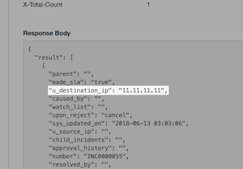

# Polarity Service Now Integration

Polarity's ServiceNow integration allows the lookup of system user emails, domains, IPv4s, and optionally strings from channels for incident and/or asset information, ServiceNow change request IDs (e.g. CHG00000012), ServiceNow incident IDs (e.g. INC00000154), ServiceNow Request IDs (e.g. REQ00000155), ServiceNow Requested Item IDs (e.g. RITM00000123), and ServiceNow Knowledge Base IDs (e.g. KB0000008) against your instance of ServiceNow.  In addition, we can search for IPv4 addresses against custom fields that you specify when searching Incidents.

To learn more about ServiceNow, visit the [official website](https://servicenow.com).

| 
|---|
|*Service Now Example*|

## Service Now Integration Options

### Service Now Server URL
The URL for your Service Now server which should include the schema (i.e., http, https) and port if required

### Username
The username of the Service Now user you want the integration to authenticate as.  The user should have permissions to access the `sys_user`, `incident`, `sc_request`, `sc_req_item` and `change_request` tables.

### Password
The password for the provided username you want the integration to authenticate as.

### Search By String
This will toggle whether or not to search the ServiceNow's Asset Table with strings found in your channels.

### Search Field for Asset Lookups
A comma separated list of fields to search domains and IPs by in ServiceNow's Asset Table. Default is dns_domain, sys_domain_path, ip_address.

### Custom IPv4 Fields
A comma separated list of fields to lookup on IP matches. See below for use.

## IP Lookups
Because ServiceNow is often customized to fit specific needs, Polarity's ServiceNow Integration offers the ability to look up IPv4 matches on custom Incident and Asset fields. Simply add a comma separated list of custom fields to the `Custom Fields` integration option, and when Polarity recognizes an IP address, it will look up the address in the custom fields you listed and display the results.  To determine what value you should put in this field your can reference our guide [**Here**](./HowToFindCustomFields.md) using the dashboard, or you can use the ServiceNow REST API Explorer to examine an incident and look for the custom field on the response object. They are usually prepended with a `u_` and then the name of the custom field, in lower case, underscore (`_`) separated.

|
|---|
|*Custom Field Example*|

## Polarity

Polarity is a memory-augmentation platform that improves and accelerates analyst decision making.  For more information about the Polarity platform please see:

https://polarity.io/
