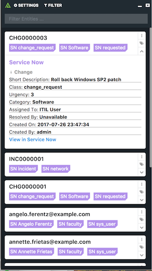

# Polarity Service Now Integration

Polarity's Service Now Integration allows the lookup of emails, Service Now change request IDs (e.g. CHG00000012), and Service Now incident IDs (e.g. INC00000154) against your instance of Service Now.

To learn more about Service Now, visit the [offical website](https://servicenow.com).

> Note that this integration is currently in beta.

| 
|---|
|*Service Now Example*|

## Service Now Integration Options

### Service Now Server URL
The URL for your Service Now server which should include the schema (i.e., http, https) and port if required

### Username
The username of the Service Now user you want the integration to authenticate as.  The user should have permissions to access the `sys_user`, `incident`, and `change_request` tables.

### Password
The password for the provided username you want the integration to authenticate as.

### Custom Fields
A comma separated list of fields to lookup on IP matches. See below for use.

## IP Lookups
Because Service Now is often customized to fit specific needs, Polarity's Service Now Integration offers the ability to look up IP matches on custom fields on Incidents. Simply add a comma separated list of custom fields to the `Custom Fields` integration option, and when Polarity reognizes an IP address, it will look up the address in the custom fields you listed and display the results.

## Polarity

Polarity is a memory-augmentation platform that improves and accelerates analyst decision making.  For more information about the Polarity platform please see: 

https://polarity.io/
